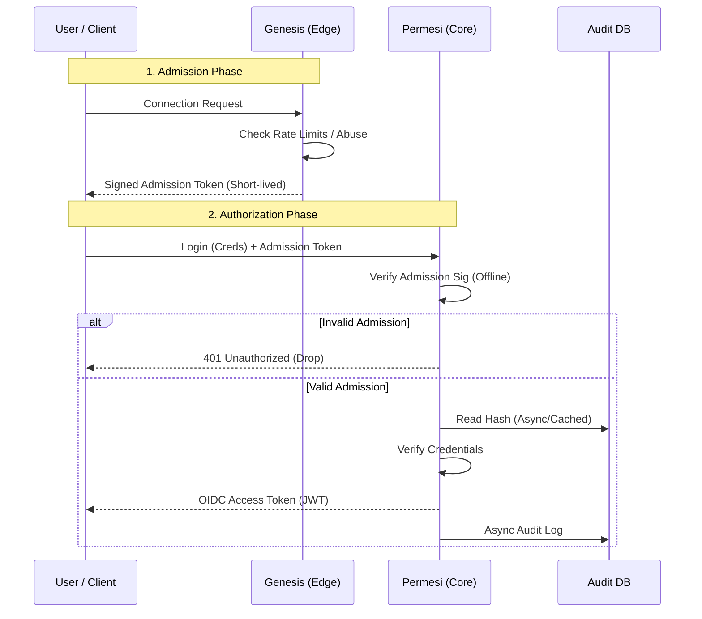

# permesi

**permesi** Identity and Access Management

## Architecture

permesi employs a **Split-Trust Architecture** to separate network noise from core identity logic.

### The Components

#### 1. `genesis` (The Edge / "The Bouncer")
* **Role:** Public-facing edge service.
* **Responsibility:** Handles raw TCP/HTTP connections, enforces strict rate limits, performs PoW (Proof of Work) challenges for abuse prevention, and sanitizes inputs.
* **Output:** Issues a short-lived, cryptographically signed **Admission Token**.
* **State:** Stateless / Ephemeral.

#### 2. `permesi` (The Core / "The Authority")
* **Role:** The OIDC Authority.
* **Responsibility:** Validates User Credentials and OIDC flows.
* **Trust Model:** Verifies **Admission Tokens** from `genesis` *offline* (using public key cryptography) without needing runtime API calls to the edge.
* **Output:** Issues standard OIDC Access/ID Tokens (JWTs).

#### 3. Database
* **Role:** System of Record.
* **Usage:** Primarily for **Audit Logs** and **Revocation Lists**. It is **not** required for the hot-path verification of Admission Tokens, ensuring high availability even during DB latency spikes.

---

## The Authentication Flow

