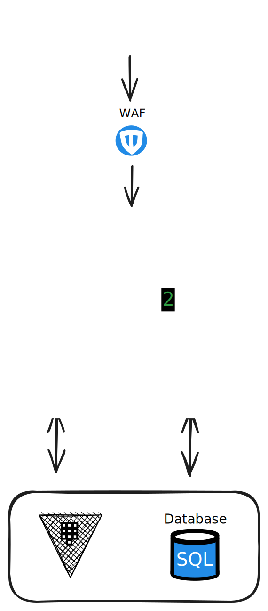
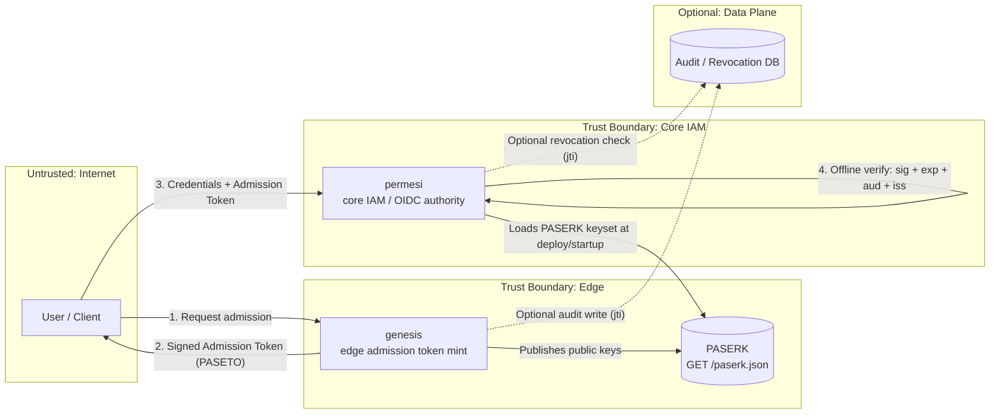
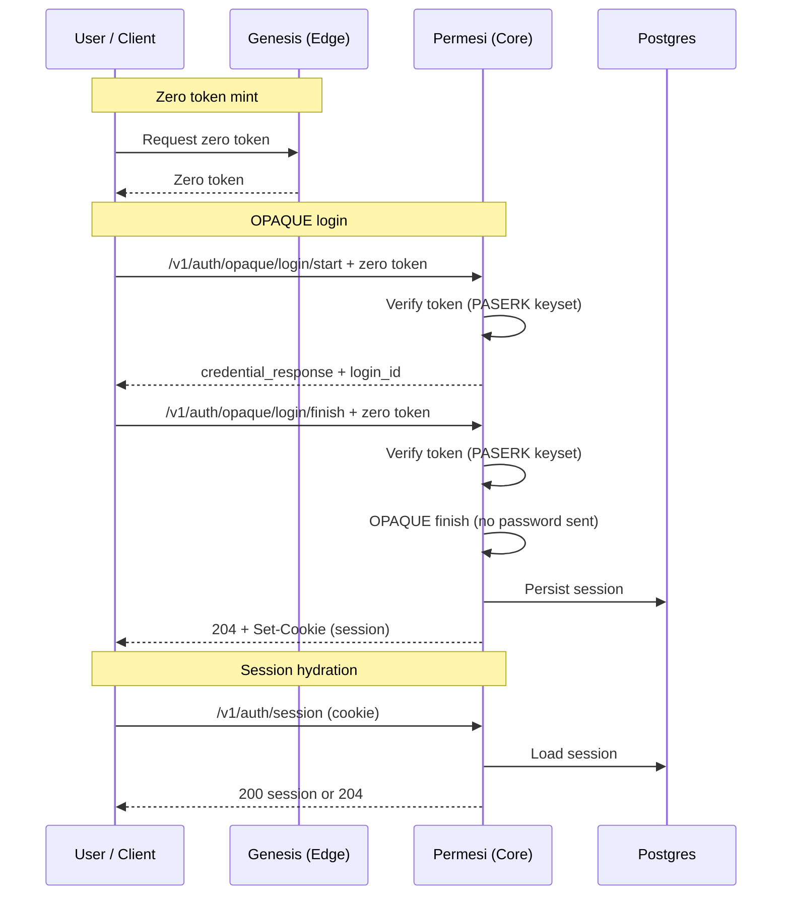
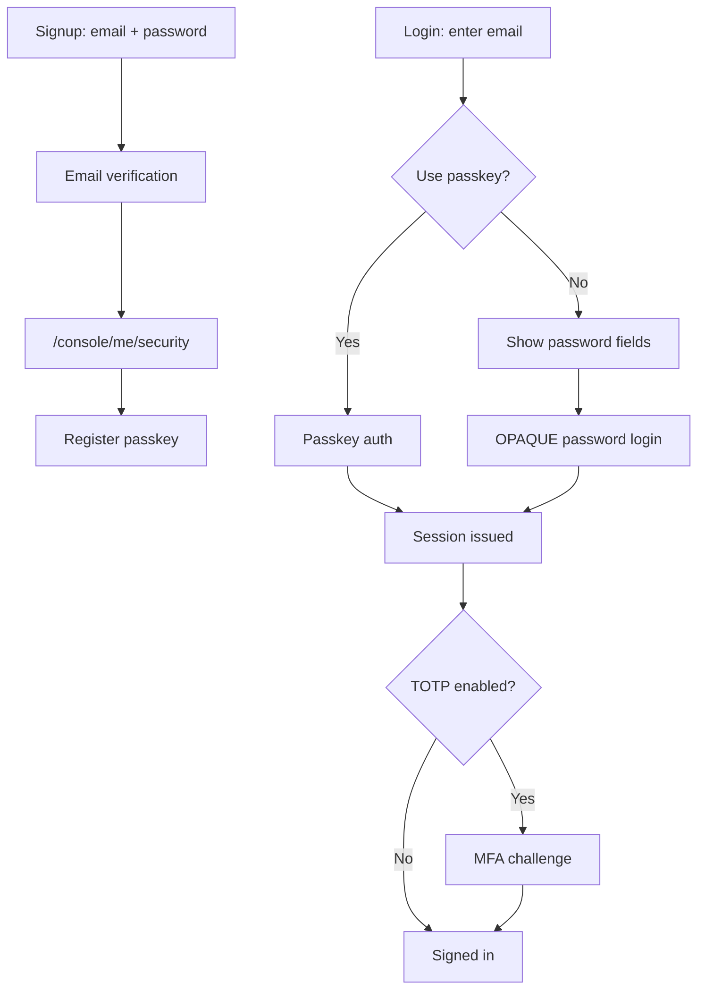

# permesi

**permesi** Identity and Access Management

[](https://github.com/permesi/permesi/actions/workflows/build.yml)
[](https://codecov.io/gh/permesi/permesi)



## Workspace Layout

This repository is a Rust workspace (monorepo) containing:

- `services/permesi`: core IAM / OIDC authority
- `services/genesis`: edge admission token mint
- `crates/admission_token`: shared admission token contract + sign/verify helpers
- `apps/web`: CSR-only Leptos admin console (Trunk + Tailwind, static `dist/`)

Note: service HTTP modules live under `src/api/` (previously `src/permesi/` and `src/genesis/`).

## Architecture

permesi employs a **Split-Trust Architecture** to separate network noise from core identity logic.

### The Components

#### 1. `genesis` (The Edge / "The Bouncer")
* **Role:** Public-facing edge service.
* **Responsibility:** Handles raw TCP/HTTP connections, enforces strict rate limits, performs PoW (Proof of Work) challenges for abuse prevention, and sanitizes inputs.
* **Output:** Issues a short-lived, cryptographically signed **Admission Token**.
* **State:** Stateless / Ephemeral.
* **Key Publication:** Publishes a PASERK keyset at `GET /paserk.json`.

#### 2. `permesi` (The Core / "The Authority")
* **Role:** The OIDC Authority.
* **Responsibility:** OPAQUE signup/login, email verification, and OIDC flows.
* **Trust Model:** Verifies **Admission Tokens** from `genesis` *offline* (signature + `exp` + `aud` + `iss`) without calling `genesis` during normal request handling. Validates short-lived **Zero Tokens** offline using the PASERK keyset for auth POSTs.
* **Output:** Issues standard OIDC Access/ID Tokens (JWTs).

#### 3. Database
* **Role:** System of Record.
* **Usage:** Stores user records (OPAQUE registration records), email verification tokens/outbox, plus **Audit Logs** and **Revocation Lists**. It is **not** required for the hot-path verification of Admission Tokens, ensuring high availability even during DB latency spikes.

---

## Production bootstrap (no containers)

To bootstrap Postgres without the local container flow, run the SQL directly. `db/sql/` is the
single source of truth for dev containers and bare-metal setups:

```sh
# 1) Create Vault root users, runtime roles, grants, and load schemas (edit passwords first).
psql "postgres://<admin>@<host>:5432/postgres" -v ON_ERROR_STOP=1 -f db/sql/00_init.sql
```

`db/sql/00_init.sql` uses dev defaults (`vault_genesis` / `vault_permesi` with the same password).
For production, update those passwords and remove the `seed_test_client.sql` include before
running it, or use it as a template for your own bootstrap script. If you choose not to run
`db/sql/00_init.sql`, load the service schemas directly with `db/sql/01_genesis.sql` and
`db/sql/02_permesi.sql`.

For scheduled maintenance, `db/sql/cron_jobs.sql` is the only place where pg_cron jobs are
registered (run it against the `postgres` database). Application schemas never install or
schedule pg_cron jobs directly.

## Cryptography

- **Admission tokens:** PASETO v4.public (Ed25519). `genesis` signs via Vault Transit; private keys never leave Vault. Public keys are published via a PASERK keyset for offline verification.
- **permesi encryption:** Vault Transit key type `chacha20-poly1305` (default `transit/permesi` / key `users`) for encrypt/decrypt operations.
- **OPAQUE (user auth):** Client-side OPAQUE; server stores only the registration record. The server setup seed is stored in Vault KV v2 (`opaque_server_seed`).

## Admission Token Verification (Offline)

Admission token verification never calls `genesis` on the hot path. The flow is:

1. `genesis` signs a PASETO v4.public token with Vault Transit and puts the PASERK ID (`k4.pid...`) in the token footer as `kid`.
2. `permesi` parses the footer `kid`, looks up the matching `k4.public...` key in the PASERK keyset, and verifies the signature.
3. `permesi` validates claims (`iss`, `aud`, `action`, `iat/exp`, TTL). If any check fails, the request is rejected.

Keyset behavior:

- `active_kid` is only used by `genesis` to choose the signing key. Verification always uses the token's footer `kid`.
- When configured with a PASERK URL, `permesi` caches `/paserk.json` (default TTL 5 minutes) and refreshes it on unknown `kid` with a cooldown. No per-request calls are made.
- When configured with a local file or JSON string, verification is fully offline (no network fetches).

Missing / planned:
- Optional revocation mode (DB lookup or cached revocation list). There is no public token introspection endpoint.

## Tenant model (prototype)

Organizations are the tenant boundary in permesi. Each organization owns projects, projects own
environments, and environments own applications. Org-scoped membership and roles are the source
of authorization for tenant resources, and environment tiers enforce a single production
environment per project with non-production blocked until production exists.

More details and the creation flow live in `services/permesi/README.md` under “Organization
endpoints and authorization”.

## Trust Boundaries



## User Authentication (OPAQUE + Zero Token)

All auth POSTs require a Genesis zero token (validated offline using the PASERK keyset).



 Signup uses `/v1/auth/opaque/signup/start` + `/finish` and email verification uses `/v1/auth/verify-email` + `/v1/auth/resend-verification` (all require zero tokens).

## Passkey + MFA Login Flow

Users sign up with email and password, then can register passkeys from `/console/me/security` once they are logged in. The login page prioritizes passwordless flows; users enter their email and can sign in with a passkey, or expand the password form if they want to use OPAQUE.

MFA enforcement is consistent across login paths. If TOTP is enabled for the account, the login flow always proceeds to the MFA challenge after either password or passkey authentication succeeds.



### Admin Rate Limiting
Administrative endpoints (bootstrap and elevation) are strictly rate-limited to 3 attempts per 10 minutes per user to protect against Vault token brute-forcing. Consecutive failures trigger a 15-minute cooldown.

### Auth endpoints (quick scan)
| Method | Path | Notes |
|---|---|---|
| `POST` | `/v1/auth/opaque/signup/start` | OPAQUE registration start; requires zero token |
| `POST` | `/v1/auth/opaque/signup/finish` | OPAQUE registration finish; requires zero token |
| `POST` | `/v1/auth/opaque/login/start` | OPAQUE login start; requires zero token |
| `POST` | `/v1/auth/opaque/login/finish` | OPAQUE login finish; requires zero token |
| `POST` | `/v1/auth/verify-email` | Consume email verification token; requires zero token |
| `POST` | `/v1/auth/resend-verification` | Resend verification link; requires zero token |

## Vault Dependency

Vault is required for both services in production (AppRole auth, dynamic DB creds, transit encryption, and the OPAQUE seed in KV v2). Running without Vault is not supported.

Production readiness checklist:
- HA cluster with tested failover.
- Automated unseal or a documented unseal runbook.
- Backups plus restore drills (e.g., raft snapshots or storage backups).
- Monitoring and alerts for health, sealed state, and token/lease renew failures.

## Build

- `cargo build -p permesi`
- `cargo build -p genesis`
- **Terraform** (v1.5+): Required for provisioning local Vault infrastructure.

## Web Console

- `just web`: Tailwind build/watch + Trunk dev server.
- `just web-build`: production build (`apps/web/dist`).
- Node.js is only required for CSS tooling; the output is fully static.
- Frontend env is compile-time (via `option_env!`). Set `PERMESI_API_BASE_URL`, `PERMESI_TOKEN_BASE_URL`, and `PERMESI_CLIENT_ID` before build.
- `PERMESI_CLIENT_ID` is public (embedded in WASM); store it in GitHub Actions Variables, not Secrets.

## Local Development (Full Flow)

Default ports: genesis `8000`, permesi `8001`, web `8080`.

Local HTTPS is now the default for development. We use the `.test` domain to avoid `.localhost` IPv6 resolution issues and keep WebAuthn happy with HTTPS. Run `just localhost-hosts` once to map the `.test` hosts to `127.0.0.1`, then `just mkcert-local` to install the local CA and generate certs. `just start` launches HAProxy with TLS termination on port `443`. The Trunk dev server runs on `8081` behind HAProxy and binds to `0.0.0.0` for container access.
If HAProxy can't reach host services on macOS, it will fall back to `host.docker.internal` automatically.
On Linux, if server-side HTTPS calls fail (e.g., `admission_keyset` health is red), run `just mkcert-trust` to install the mkcert root CA into the system trust store used by Rust/reqwest (supports `update-ca-certificates` and Arch’s `/etc/ca-certificates/trust-source/anchors`).

1) One command: `just start` (infra + `.envrc` + web).
2) Run services: `just genesis` and `just permesi` (they auto-source `.envrc`, so direnv is optional).

`just start` uses tmux when available to start a `permesi` session with genesis + permesi + web panes, plus a fourth pane for ad hoc commands.
If you're already inside tmux, it creates the `permesi` session in the background and prints attach instructions.
Re-running attaches to the existing session when not inside tmux; stop with `tmux kill-session -t permesi`.

Because AppRole SecretIDs are single-use (`secret_id_num_uses=1`), `just genesis` and `just permesi` fetch a fresh
SecretID before each `cargo watch` run using the Vault CLI. Make sure `vault` is installed and authenticated (via
`VAULT_ADDR`/`VAULT_TOKEN` or your Vault token helper).

If you want infra only: `just dev-start-infra` then `just dev-envrc` (this also runs `direnv allow` if available).
If Postgres init scripts didn't run (for example, an existing `db/data`), run `just db-bootstrap`
to (re)apply schemas and runtime roles, then `just db-verify` to confirm constraints.

Cleanup: `just stop` to stop containers, and `just reset` to remove the infra containers, wipe Vault data, and delete local Postgres data/logs (`db/data`, `db/logs`).

`just dev-envrc` emits Vault credentials plus local endpoints:
- `PERMESI_ADMISSION_PASERK_URL=https://genesis.permesi.localhost/paserk.json`
- `PERMESI_FRONTEND_BASE_URL=https://permesi.localhost`
- `PERMESI_API_BASE_URL=https://api.permesi.localhost`
- `PERMESI_TOKEN_BASE_URL=https://genesis.permesi.localhost`
- `PERMESI_PASSKEYS_ALLOWED_ORIGINS=https://permesi.localhost`
- `PERMESI_OPERATOR_TOKEN` (used for `/admin/claim`)

Passkey registration is available in preview mode by default and does not persist credentials without additional storage. Configure the relying party and origin validation via `PERMESI_PASSKEYS_RP_ID`, `PERMESI_PASSKEYS_RP_NAME`, and `PERMESI_PASSKEYS_ALLOWED_ORIGINS`, adjust challenge TTL with `PERMESI_PASSKEYS_CHALLENGE_TTL_SECONDS`, and toggle preview behavior with `PERMESI_PASSKEYS_PREVIEW_MODE`. Persisting passkeys would require a dedicated table to store `credential_id` (bytes), `user_id`, `public_key` (serialized passkey), `sign_count`, `transports`, `created_at`, and `last_used_at` (nullable).

### Local HTTPS for Passkeys (mkcert + HAProxy)

Passkeys require HTTPS. The repo includes a local HAProxy config at `config/haproxy/haproxy.cfg` that terminates TLS and routes `permesi.localhost`, `api.permesi.localhost`, and `genesis.permesi.localhost` to the usual local ports. Generate a local certificate with mkcert, combine it for HAProxy, then run the container:

```
just mkcert-local

just haproxy-start

```

Manual steps (if you prefer to run them directly):

```
mkcert -install
mkcert -key-file config/haproxy/certs/permesi.localhost-key.pem \
  -cert-file config/haproxy/certs/permesi.localhost-cert.pem \
  "localhost" "127.0.0.1" "::1" "*.localhost" \
  "permesi.localhost" "api.permesi.localhost" "genesis.permesi.localhost" "*.permesi.localhost"
cat config/haproxy/certs/permesi.localhost-cert.pem config/haproxy/certs/permesi.localhost-key.pem \
  > config/haproxy/certs/permesi.localhost.pem

podman run -d --name permesi-haproxy \
  --add-host=host.containers.internal:host-gateway \
  -p 443:8080 \
  -v "$(pwd)/config/haproxy/haproxy.cfg:/usr/local/etc/haproxy/haproxy.cfg:ro" \
  -v "$(pwd)/config/haproxy/certs:/usr/local/etc/haproxy/certs:ro" \
  docker.io/haproxy:latest
```

On Linux, binding to `:443` may require allowing unprivileged ports: `sudo sysctl -w net.ipv4.ip_unprivileged_port_start=443` (persist with a sysctl.d config if desired). If you want to avoid IPv6 resolution issues, add IPv4 host entries via `just localhost-hosts`.
You can run `just haproxy-sysctl` to apply the sysctl setting.

### Testing Admin Claim (Platform Operator)
To test bootstrapping the first admin or elevating privileges, you need a Vault token with the `permesi-operators` policy.
The dev bootstrap automatically generates one and prints it to stdout (or exports it via `just dev-envrc`).

1. Copy the **Operator Token** from startup logs or run `echo $PERMESI_OPERATOR_TOKEN`.
2. Navigate to `https://permesi.localhost/admin/claim`.
3. Paste the token and submit to claim the operator role.

## API Contract (OpenAPI)

This repo treats the OpenAPI specs as versioned artifacts, checked in under:

- `docs/openapi/permesi.json`
- `docs/openapi/genesis.json`

Regenerate them from code:

- `cargo run -p permesi --bin permesi-openapi > docs/openapi/permesi.json`
- `cargo run -p genesis --bin genesis-openapi > docs/openapi/genesis.json`

## Containers

- `podman build -f services/permesi/Dockerfile -t permesi:dev .`
- `podman build -f services/genesis/Dockerfile -t genesis:dev .`

## Local Tracing (Jaeger)

Send OTLP traces directly to the local Jaeger collector:

```sh
export OTEL_EXPORTER_OTLP_ENDPOINT=http://localhost:4317
```

Open the Jaeger UI at http://localhost:16686 to inspect traces.

## CI Commands

- `cargo fmt --all -- --check`
- `cargo clippy --all-targets --all-features`
- `cargo test --workspace`
