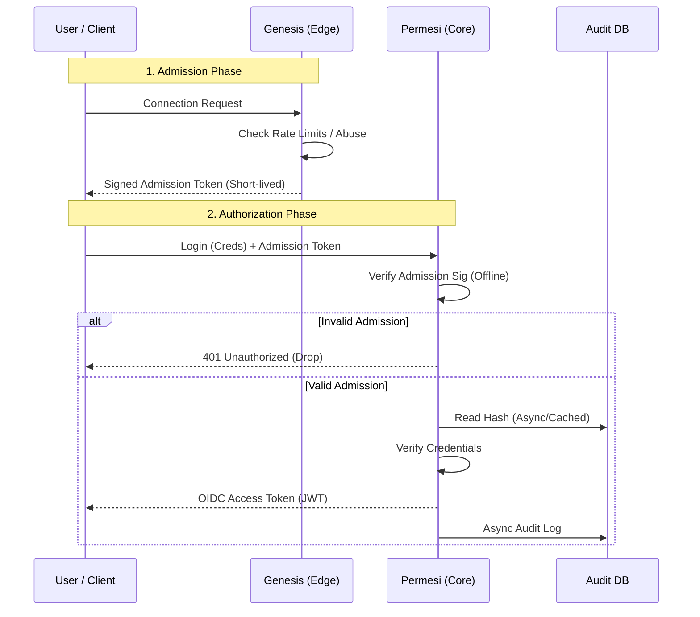

# permesi

**permesi** Identity and Access Management

[](https://crates.io/crates/permesi)
[](https://github.com/permesi/permesi/actions/workflows/build.yml)
[](https://codecov.io/gh/permesi/permesi)


## Workspace Layout

This repository is a Rust workspace (monorepo) containing:

- `services/permesi`: core IAM / OIDC authority
- `services/genesis`: edge admission token mint
- `crates/admission_token`: shared admission token contract + sign/verify helpers

## Architecture

permesi employs a **Split-Trust Architecture** to separate network noise from core identity logic.

### The Components

#### 1. `genesis` (The Edge / "The Bouncer")
* **Role:** Public-facing edge service.
* **Responsibility:** Handles raw TCP/HTTP connections, enforces strict rate limits, performs PoW (Proof of Work) challenges for abuse prevention, and sanitizes inputs.
* **Output:** Issues a short-lived, cryptographically signed **Admission Token**.
* **State:** Stateless / Ephemeral.
* **Key Publication:** Publishes a JWKS at `GET /jwks.json`.

#### 2. `permesi` (The Core / "The Authority")
* **Role:** The OIDC Authority.
* **Responsibility:** Validates User Credentials and OIDC flows.
* **Trust Model:** Verifies **Admission Tokens** from `genesis` *offline* (signature + `exp` + `aud` + `iss`) without calling `genesis` during normal request handling.
* **Output:** Issues standard OIDC Access/ID Tokens (JWTs).

#### 3. Database
* **Role:** System of Record.
* **Usage:** Primarily for **Audit Logs** and **Revocation Lists**. It is **not** required for the hot-path verification of Admission Tokens, ensuring high availability even during DB latency spikes.

---

## Trust Boundaries

```mermaid
flowchart LR
  subgraph Internet["Untrusted: Internet"]
    U[User / Client]
  end

  subgraph Edge["Trust Boundary: Edge"]
    G[genesis<br/>edge admission token mint]
    JWKS[(JWKS<br/>GET /jwks.json)]
  end

  subgraph Core["Trust Boundary: Core IAM"]
    P[permesi<br/>core IAM / OIDC authority]
  end

  subgraph Data["Optional: Data Plane"]
    DB[(Audit / Revocation DB)]
  end

  U -->|1. Request admission| G
  G -->|2. Signed Admission Token (JWT)| U

  G -->|Publishes public keys| JWKS
  P -->|Loads JWKS at deploy/startup| JWKS

  U -->|3. Credentials + Admission Token| P
  P -->|4. Offline verify: sig + exp + aud + iss| P

  G -.->|Optional audit write (jti)| DB
  P -.->|Optional revocation check (jti)| DB
```

## The Authentication Flow



## Vault Dependency

Vault is required for both services in production (AppRole auth, dynamic DB creds, transit encryption). Running without Vault is not supported.

Production readiness checklist:
- HA cluster with tested failover.
- Automated unseal or a documented unseal runbook.
- Backups plus restore drills (e.g., raft snapshots or storage backups).
- Monitoring and alerts for health, sealed state, and token/lease renew failures.

## Build

- `cargo build -p permesi`
- `cargo build -p genesis`

## API Contract (OpenAPI)

This repo treats the OpenAPI specs as versioned artifacts, checked in under:

- `docs/openapi/permesi.json`
- `docs/openapi/genesis.json`

Regenerate them from code:

- `cargo run -p permesi --bin openapi > docs/openapi/permesi.json`
- `cargo run -p genesis --bin openapi > docs/openapi/genesis.json`

## Containers

- `podman build -f services/permesi/Dockerfile -t permesi:dev .`
- `podman build -f services/genesis/Dockerfile -t genesis:dev .`

## CI Commands

- `cargo fmt --all -- --check`
- `cargo clippy --all-targets --all-features`
- `cargo test --workspace`
