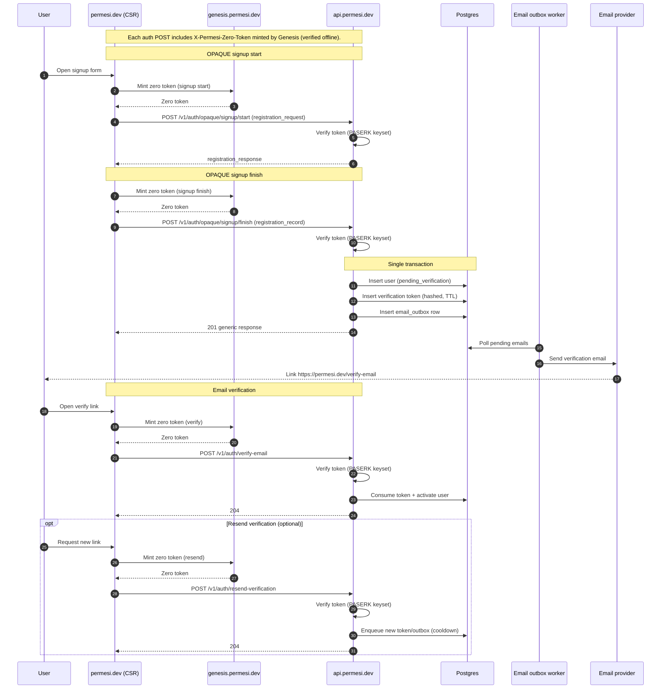

# permesi_web

CSR-only Leptos frontend built with Trunk. Outputs static assets for hosting on Cloudflare Pages.
Tailwind runs via Node at build/dev time only (no Node at runtime).

## Commands

- `just web`: Tailwind build/watch + Trunk dev server (recommended).
- `just web-build`: production build (`apps/web/dist`).
- `just web-css-watch`: Tailwind watch (CSS only).
- `just web-css-build`: Tailwind minified build (CSS only).
- `just web-node-setup`: install Node deps for Tailwind CLI.
- `just web-setup`: install Trunk + wasm target.
- `just web-check`: `cargo check -p permesi_web`.

Note: running `trunk serve` directly will skip CSS generation unless you also run `npm run css:watch`.

## Layout

- `src/main.rs`: wasm entrypoint and `mount_to_body`.
- `src/app.rs`: App component, router, and auth provider.
- `src/routes/`: route definitions and pages.
- `src/components/`: layout and reusable UI pieces.
- `src/features/`: domain logic for auth and users.
- `src/lib/`: shared config, API wrapper, and errors.
- `public/`: static files copied to the dist root (reference with `/logo.svg`, `/favicon.ico`, etc.).
- `assets/app.css`: Tailwind v4 entrypoint (`@config`, `@source`, `@import "tailwindcss"`).
- `assets/app.gen.css`: generated Tailwind output (ignored in git).
- `index.html`: Trunk pipeline (copies `public/`, pulls CSS and wasm).

## Routes

- `/`: Dashboard
- `/health`: Build version (git commit)
- `/login`: Sign in
- `/signup`: Sign up
- `/verify-email`: Verify email token + resend link
- `/users`: Users list
- `/users/:id`: User detail
- any other path: Not Found

## Signup + Email Verification Flow

Legend:
- `registration_request`: OPAQUE client message (start)
- `registration_response`: OPAQUE server message (start)
- `registration_record`: OPAQUE client registration upload (finish)

## Current UI state

- Home (`/`) is a placeholder ("Home").
- Header shows only the "Sign In" link for now (Solid parity).
- Login performs OPAQUE (`/v1/auth/opaque/login/start` + `/finish`) and fetches a Genesis zero token for each step; permesi sets an HttpOnly session cookie and the frontend reads `/v1/auth/session` to hydrate state.
- Signup performs an OPAQUE registration (`/v1/auth/opaque/signup/start` + `/finish`) with Genesis zero tokens and shows a verify-email prompt.
- Verify email reads the fragment token and POSTs to `/v1/auth/verify-email`; resend is available on the same page (both require zero tokens).
- Auth is UX-only; real access control must be enforced by the API.

## API base URL configuration

- Build-time: `PERMESI_API_BASE_URL=https://api.permesi.dev trunk build --release`
- Fallback: `PERMESI_API_HOST` is also supported.
- Default: empty base URL (uses relative `/api/...`).
- CI default: `main` builds use `https://api.permesi.com`, `develop` builds use `https://api.permesi.dev` unless `PERMESI_API_BASE_URL` is set as a GitHub Actions Variable.
- OPAQUE server identifier: `PERMESI_OPAQUE_SERVER_ID` (default `api.permesi.dev`).

## Runtime config (optional)

The UI can override build-time config by loading `public/config.js`, which sets `window.PERMESI_CONFIG`.
This keeps the build static but lets deployers change endpoints and client IDs without rebuilding.
All values are public, so never store secrets in this file.

## Admission token configuration

- Token host: `PERMESI_TOKEN_BASE_URL=https://genesis.permesi.dev` (or `PERMESI_TOKEN_HOST` / legacy `PERMESI_API_TOKEN_HOST`).
- Client ID: `PERMESI_CLIENT_ID=<uuid>` (required to mint `/token`).
- These values are compile-time (`option_env!`). Set them before `trunk build`.
- `PERMESI_CLIENT_ID` is public (embedded in the WASM). In CI, store it as a GitHub Actions **Variable**, not a Secret.
- CI default: `main` builds use `https://genesis.permesi.com`, `develop` builds use `https://genesis.permesi.dev` unless `PERMESI_TOKEN_BASE_URL` is set as a GitHub Actions Variable.

## Styling

Tailwind v4 is built via Node in `apps/web/` (`npm install`, then `npm run css:watch` or `npm run css:build`).
Trunk consumes the generated `apps/web/assets/app.gen.css` (no Node at runtime).
The entry file (`assets/app.css`) declares explicit `@source` globs so `.rs` templates are scanned.
Avoid dynamic Tailwind class construction so content scanning stays deterministic.
PostCSS config (`apps/web/postcss.config.cjs`) is provided for tooling parity.
