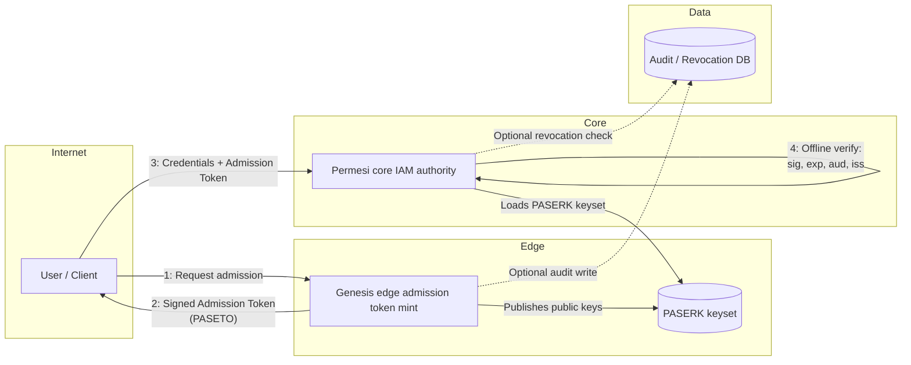
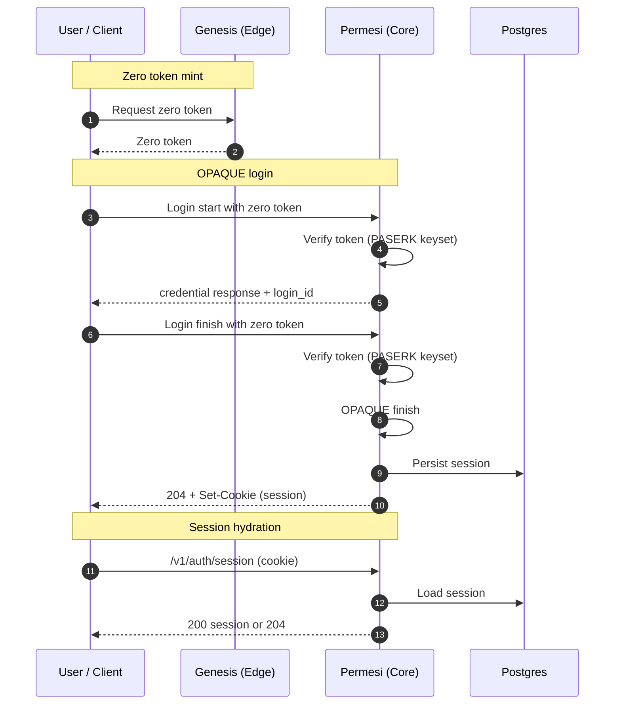

# Architecture

Permesi employs a **Split-Trust Architecture** to separate network noise from core identity logic.

## System Overview

## Admission Token Verification (Offline)

Admission token verification never calls `genesis` on the hot path. The flow is:

1. `genesis` signs a PASETO v4.public token with Vault Transit and puts the PASERK ID (`k4.pid...`) in the token footer as `kid`.
2. `permesi` parses the footer `kid`, looks up the matching `k4.public...` key in the PASERK keyset, and verifies the signature.
3. `permesi` validates claims (`iss`, `aud`, `action`, `iat/exp`, TTL). If any check fails, the request is rejected.

### Keyset Behavior

- **Active KID**: `active_kid` is only used by `genesis` to choose the signing key. Verification always uses the token's footer `kid`.
- **Caching**: When configured with a PASERK URL, `permesi` caches `/paserk.json` (default TTL 5 minutes) and refreshes it on unknown `kid` with a cooldown. No per-request calls are made.
- **Offline Mode**: When configured with a local file or JSON string, verification is fully offline (no network fetches).

## User Authentication (OPAQUE + Zero Token)

All auth POSTs require a Genesis zero token (validated offline using the PASERK keyset).

