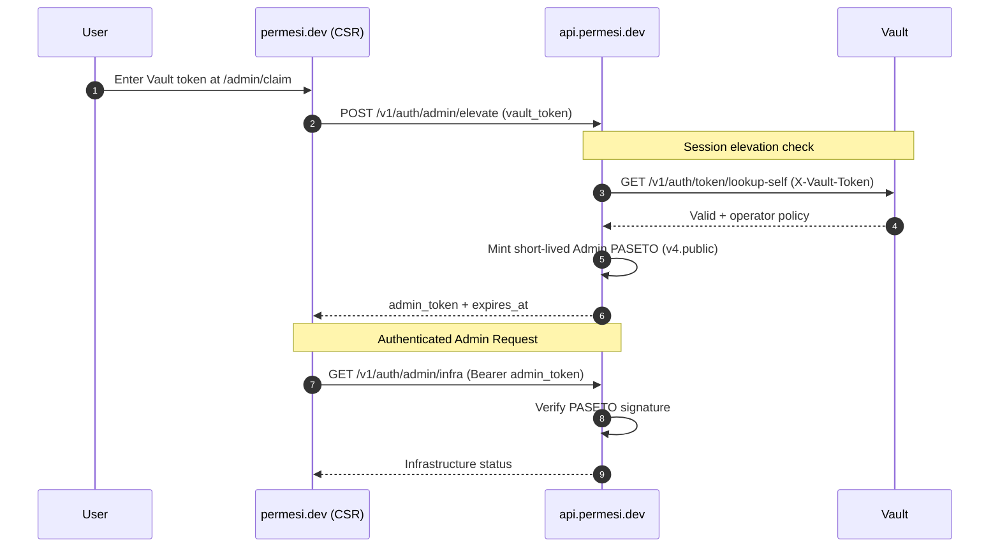

# Admin Elevation

Platform operators must elevate their session to access administrative routes. This flow ensures that powerful actions require a short-lived step-up token backed by Vault.

## The Flow

## Security Design

1. **Vault Step-up**: The operator provides a Vault token which is exchanged for a short-lived, signed PASETO admin token. The Vault token is never persisted or stored in the browser; it is only used once to mint the admin token.
2. **PASETO Admin Token**: Subsequent administrative requests use this token in the `Authorization: Bearer` header. The backend verifies the signature offline using its internal signing key.
3. **Memory Storage**: The admin token is stored in memory and is automatically cleared upon expiration or logout, ensuring no persistent administrative privileges.
4. **Rate Limiting**: The elevation endpoint is strictly rate-limited to 3 attempts per 10 minutes per user to protect against Vault token brute-forcing.