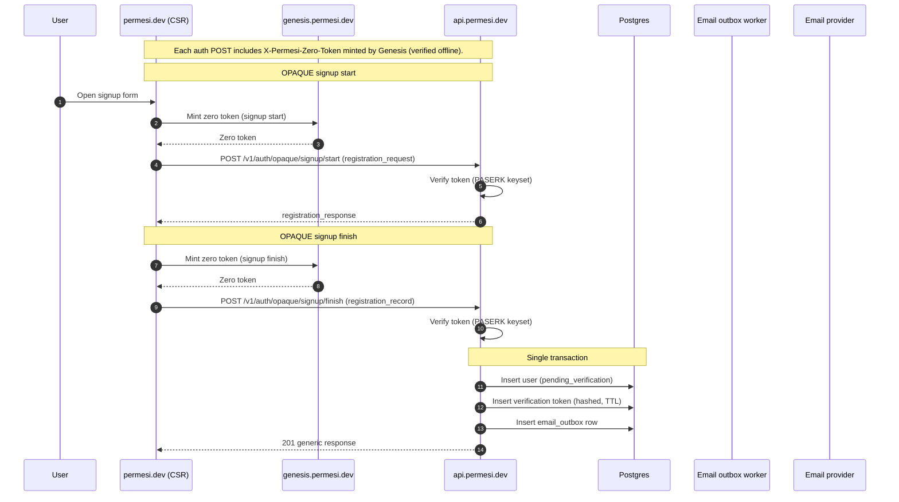

# Web Application

The Permesi frontend is a CSR-only (Client-Side Rendered) application built with **Leptos** and **Trunk**.

## Architecture

The frontend communicates with both `genesis` and `permesi`:

- **Genesis**: Used to fetch "Zero Tokens" required for all sensitive authentication operations (signup, login, email verification).
- **Permesi**: Used for session management, user profile updates, and administrative actions.

## Authentication Flow

All authentication requests are gated by a Genesis admission token.

## State Management

- **Session Hydration**: Happens once on app mount via `/v1/auth/session`.
- **In-Memory Tokens**: Session and Admin tokens are stored in Leptos `RwSignal` signals and are never persisted to local storage to prevent leakage.
- **Role-Gating**: The UI provides UX-level gating for "Workspace" and "Platform Admin" sections based on the user's role and elevation status.

## Configuration

Configuration is provided at build-time via environment variables (e.g., `PERMESI_API_BASE_URL`, `PERMESI_CLIENT_ID`). These can be overridden at runtime by a `public/config.js` file if necessary.