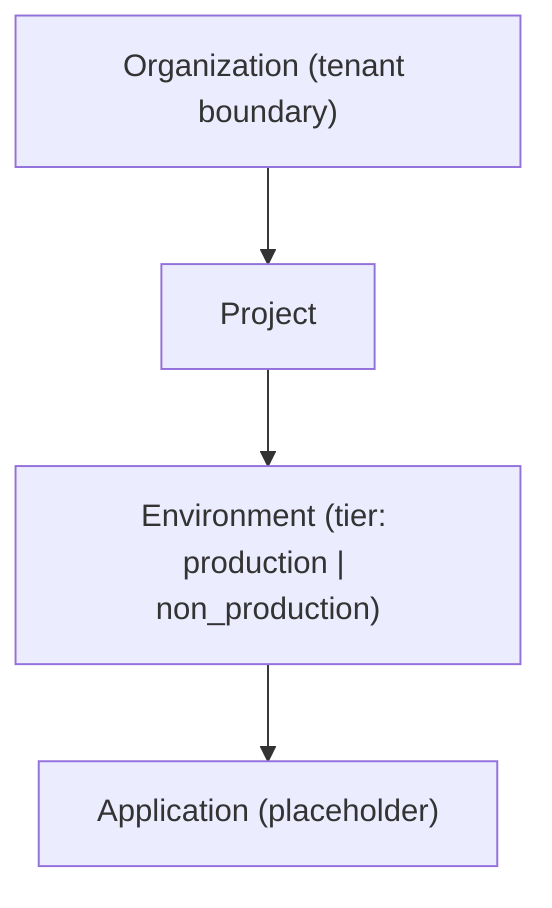

# Permesi (The Authority)

`permesi` is the core IAM and OIDC authority. It manages the identity lifecycle, including registration, authentication, and organizational hierarchy.

## Overview

`permesi` is responsible for:

- **OPAQUE Auth**: Implementing the OPAQUE protocol for zero-knowledge password authentication.
- **OIDC Flows**: Issuing standard OIDC Access and ID tokens (JWTs).
- **Tenant Model**: Managing Organizations, Projects, and Environments.
- **Offline Verification**: Validating tokens from `genesis` without network calls.

## Tenant Model

Permesi uses a hierarchical tenant model:

### Hierarchy Rules

- **Organizations**: The top-level boundary.
- **Projects**: Owned by Organizations.
- **Environments**: Belong to Projects. Each project must have exactly one `production` environment before `non_production` environments can be created.
- **Applications**: Hosted within Environments.

## API Endpoints

### Authentication (OPAQUE)

All auth POSTs require an `X-Permesi-Zero-Token` header minted by `genesis`.

- `POST /v1/auth/opaque/signup/start` / `finish`
- `POST /v1/auth/opaque/login/start` / `finish`
- `POST /v1/auth/verify-email`
- `POST /v1/auth/resend-verification`

### User Management

- `GET /v1/me`: Get current user profile.
- `PATCH /v1/me`: Update profile.
- `GET /v1/me/sessions`: List active sessions.

### Administrative Gating

Administrative endpoints (bootstrap and elevation) are strictly rate-limited and require a Vault-backed elevation token.

- **Attempt Limit**: 3 attempts per user within a 10-minute window.
- **Failure Cooldown**: 15 minutes after 3 consecutive failures.

## Email Outbox

Permesi uses a transactional email outbox pattern. Signup and verification requests enqueue work in the `email_outbox` table within the same transaction as the user creation. A background worker then processes these rows with exponential backoff and jitter.

## OPAQUE Seed

The server-side OPAQUE configuration is derived from a 32-byte seed stored securely in **Vault KV v2**. This ensures that even if the database is compromised, user authentication remains secure as the seed is required to complete the OPAQUE flow.