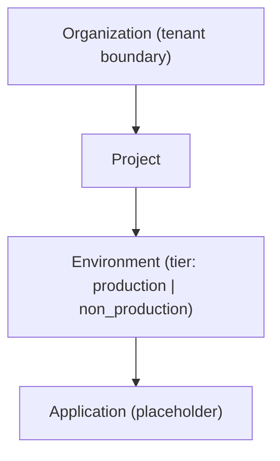
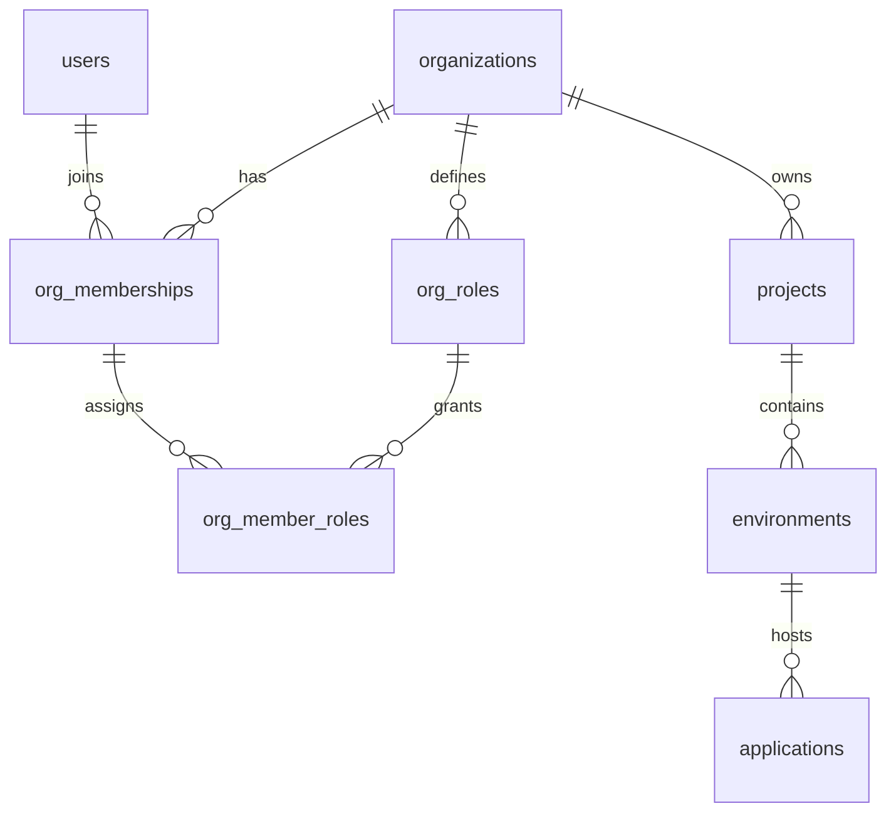

# permesi

Core IAM/OIDC authority.

## Vault requirement

Vault is required in production for AppRole auth, dynamic DB creds, and transit encryption. Running without Vault is not supported.
See the canonical checklist in `../../README.md#vault-dependency` and the Vault ops notes in `../../vault/README.md`.
TL;DR:
- Run Vault in HA with tested failover.
- Use auto-unseal or keep a documented unseal runbook.
- Alert on health, sealed state, and token/lease renew failures.

## CLI example

The `dsn` can omit username/password because Vault injects DB creds (e.g. `postgres://postgres@localhost:5432/permesi`).
Admission PASERK keyset can be provided via a local file/string or fetched from a URL.
Admission tokens use RFC3339 `iat` / `exp` claims.

Local dev note: when running the workspace frontend (Trunk on `:8081` behind HAProxy), use `--port 8001` and point the PASERK URL at `genesis` on `:8000` to avoid collisions.

### TCP Mode (AppRole)

`--vault-url` points to the AppRole login endpoint. Requires role-id and secret-id (or wrapped token).

```sh
cargo run -p permesi --bin permesi -- \
  --port 8001 \
  --dsn "postgres://postgres@localhost:5432/permesi" \
  --admission-paserk-url "https://genesis.permesi.localhost:8000/paserk.json" \
  --vault-url "http://vault:8200/v1/auth/approle/login" \
  --vault-role-id "$PERMESI_ROLE_ID" \
  --vault-secret-id "$PERMESI_SECRET_ID"
```

### Agent Mode (Unix Socket)

`--vault-url` points to the Vault Agent `api_proxy` socket. No authentication args required.

```sh
cargo run -p permesi --bin permesi -- \
  --port 8001 \
  --dsn "postgres://postgres@localhost:5432/permesi" \
  --admission-paserk-url "https://genesis.permesi.localhost:8000/paserk.json" \
  --vault-url "/run/vault/proxy.sock"
```

## Database schema

The base schema lives in `db/sql/02_permesi.sql`. Load it into Postgres with (only if you did not
run `db/sql/00_init.sql`):

```sh
psql "$PERMESI_DSN" -v ON_ERROR_STOP=1 -f db/sql/02_permesi.sql
```

The schema enables `citext`, so the role running it must have `CREATE EXTENSION` privileges on
the database.

`db/sql/` is the single source of truth for dev, containers, and bare-metal production schemas.

Vault-managed DB credentials also require bootstrap roles and grants. The canonical SQL for those
roles lives in `db/sql/00_init.sql`; it also applies the Permesi schema. For production, update the
passwords before running it, or apply the schema directly as shown above.

`db/sql/verify_permesi.sql` is a transactional smoke test that rolls back all changes. Run it
after loading the schema to verify constraints and defaults:

```sh
psql "$PERMESI_DSN" -v ON_ERROR_STOP=1 -f db/sql/verify_permesi.sql
```

## OPAQUE auth + email verification

`permesi` uses OPAQUE for signup/login. Passwords never leave the client; the database stores only
the OPAQUE registration record (`opaque_registration_record`).

### API router (OpenAPI-aware)

`permesi::api::router()` returns an `OpenApiRouter` with all documented routes registered via
`#[utoipa::path]`. Use it to build a server or to split out the OpenAPI spec in tests.

```rust
let (router, openapi) = permesi::api::router().split_for_parts();
```

Endpoints:

- `POST /v1/auth/opaque/signup/start`
- `POST /v1/auth/opaque/signup/finish`
- `POST /v1/auth/opaque/login/start`
- `POST /v1/auth/opaque/login/finish`
- `POST /v1/auth/opaque/reauth/start`
- `POST /v1/auth/opaque/reauth/finish`
- `POST /v1/auth/opaque/password/start`
- `POST /v1/auth/opaque/password/finish`
- `POST /v1/auth/passkey/login/start`
- `POST /v1/auth/passkey/login/finish`
- `POST /v1/auth/verify-email`
- `POST /v1/auth/resend-verification`
- `GET /v1/me`
- `PATCH /v1/me`
- `GET /v1/me/sessions`
- `DELETE /v1/me/sessions/{sid}`
- `POST /v1/me/webauthn/register/options`
- `POST /v1/me/webauthn/register/finish`
- `GET /v1/me/webauthn/credentials`
- `DELETE /v1/me/webauthn/credentials/{credential_id}`
- `POST /v1/orgs`
- `GET /v1/orgs`
- `GET /v1/orgs/{org_slug}`
- `PATCH /v1/orgs/{org_slug}`
- `POST /v1/orgs/{org_slug}/projects`
- `GET /v1/orgs/{org_slug}/projects`
- `POST /v1/orgs/{org_slug}/projects/{project_slug}/envs`
- `GET /v1/orgs/{org_slug}/projects/{project_slug}/envs`
- `POST /v1/orgs/{org_slug}/projects/{project_slug}/envs/{env_slug}/apps`
- `GET /v1/orgs/{org_slug}/projects/{project_slug}/envs/{env_slug}/apps`

All auth POSTs require `X-Permesi-Zero-Token` minted by `genesis`. Tokens are validated offline
using the PASERK keyset (same as Admission Tokens). Password changes require a recent re-auth
(default 10 minutes) and revoke all sessions once the new registration record is stored.

### Passkeys (WebAuthn)

Passkeys are stored in the `passkeys` table and serialized using the `webauthn-rs` `Passkey`
type to preserve counters and backup state. Passkey login issues the same session kinds as
password login (full, MFA bootstrap, or MFA challenge) based on the stored MFA state.

Set `PERMESI_PASSKEYS_PREVIEW_MODE=true` to disable persistence and login while still allowing
registration verification (useful for staged rollouts).

### Organization endpoints and authorization

Self-service user operations must use `/v1/me/*` and resolve the user from the session cookie.
Organization, project, environment, and application routes are scoped by org slug and require
active membership. Org roles (`owner`, `admin`, `member`, `readonly`) are enforced server-side:
owner/admin can mutate org resources; member/readonly are read-only. Unauthorized access is
returned as 404 to avoid resource enumeration.

Environments include a tier (`production` or `non_production`). Each project may have only one
production environment, and non-production environments are blocked until a production
environment exists, so callers must create production first.

Organization slugs are normalized to lowercase, URL-safe identifiers and must be 3–63
characters (`[a-z0-9-]`, no leading/trailing hyphen). If omitted, the slug is derived from the
name and auto-suffixed (`-2`, `-3`, …) on conflict. Project slugs follow the same rules but are
unique per org and return conflicts instead of auto-suffixing. Environment slugs are 2–32
characters with the same URL-safe rules and are unique per project.

Membership status gates authorization: only `active` members may read or mutate org resources.
Invited or suspended memberships behave as unauthorized for all org/project/env/app routes and
return 404s to avoid leaking resource existence.
Soft deletes do not reserve slugs or names: uniqueness is enforced only for rows where
`deleted_at` is null, so deleted orgs/projects/environments/apps can reuse identifiers.

Tenant model overview:



Database hierarchy (core tables + membership):



### How to create an org → project → env → app

1) Authenticate and obtain a session cookie via the OPAQUE login flow.
2) Create an organization (owner/admin only once created):

   `POST /v1/orgs` with `{ "name": "Acme", "slug": "acme" }`

3) Create a project inside the org (owner/admin required):

   `POST /v1/orgs/acme/projects` with `{ "name": "Payments", "slug": "payments" }`

4) Create the first environment and mark it as production (required before non-production):

   `POST /v1/orgs/acme/projects/payments/envs` with
   `{ "name": "Production", "slug": "prod", "tier": "production" }`

5) Create non-production environments as needed:

   `POST /v1/orgs/acme/projects/payments/envs` with
   `{ "name": "Staging", "slug": "stage", "tier": "non_production" }`

6) Create an application under an environment:

   `POST /v1/orgs/acme/projects/payments/envs/prod/apps` with `{ "name": "payments-api" }`

Always use opaque user IDs in paths. Avoid putting emails in URLs because they leak PII into logs
and proxies, complicate normalization (case/encoding), and make enumeration easier. If a flow
needs an email, keep it in the request body and apply the same rate limiting and audit controls.

### Email outbox (transactional)

Signup/resend requests enqueue email work in `email_outbox` during the same DB transaction that
creates the user + verification token. A background worker polls for `pending` rows, locks a
batch with `FOR UPDATE SKIP LOCKED`, and hands each row to an `EmailSender` implementation.
Success marks the row `sent`; failures are retried with exponential backoff + jitter using
`next_attempt_at` until max attempts is reached (default 5), then marked `failed`.
Defaults: base delay 5s, max delay 5m.

The default sender is a log-only stub for local dev. To deliver real email, implement
`EmailSender` (SMTP, SendGrid, etc.) and swap it in where the worker is spawned.
If you later need higher throughput or multi-service fan-out, consider a broker (NATS JetStream,
RabbitMQ). For current scale, the DB outbox keeps infrastructure minimal and consistent.

### Token cleanup (pg_cron or system cron)

Expired sessions and verification tokens can be purged by calling `cleanup_expired_tokens()` in
the permesi database. Use `db/sql/maintenance.sql` as a manual helper, or schedule the call via
pg_cron as described in `SETUP.md`.

`db/sql/maintenance.sql` is a manual helper that invokes the cleanup once. Scheduling is
centralized in `db/sql/cron_jobs.sql` (run against `postgres`).

See `SETUP.md` for the canonical `pg_cron` setup steps.

```sql
SELECT cleanup_expired_tokens();
```

### OPAQUE seed (Vault KV v2)

OPAQUE server setup is derived from a 32-byte seed stored in Vault KV v2:

- Mount: `--opaque-kv-mount` / `PERMESI_OPAQUE_KV_MOUNT` (default: `secret/permesi`)
- Fields:
  - `opaque_server_seed` (base64-encoded 32 bytes)
  - `mfa_recovery_pepper` (base64-encoded string)

To initialize these in Vault:

- Generate 32 random bytes and store the base64 value as `opaque_server_seed`.
- Generate a random string and store it as `mfa_recovery_pepper`.
- Example:
  ```bash
  OPAQUE_SEED=$(openssl rand -base64 32)
  MFA_PEPPER=$(openssl rand -base64 32)
  vault kv put secret/permesi/config opaque_server_seed="$OPAQUE_SEED" mfa_recovery_pepper="$MFA_PEPPER"
  ```

Rotation:
- Rotation is not routine: changing the seed invalidates all existing OPAQUE registration records.
- Only rotate if the seed is compromised or you plan a forced re-registration/reset for all users.
- There is no dual-seed support today; rotation requires a coordinated maintenance window.

Maintenance:
- Treat the seed as a long-lived secret; restrict read access to the `permesi` runtime.
- Back it up in your secret manager; losing it makes all existing registrations unusable.

### Auth config flags

- `--frontend-base-url` / `PERMESI_FRONTEND_BASE_URL` (verification link base, default `https://permesi.dev`)
- `--email-token-ttl-seconds` / `PERMESI_EMAIL_TOKEN_TTL_SECONDS`
- `--email-resend-cooldown-seconds` / `PERMESI_EMAIL_RESEND_COOLDOWN_SECONDS`
- `--opaque-server-id` / `PERMESI_OPAQUE_SERVER_ID` (default `api.permesi.dev`)
- `--opaque-login-ttl-seconds` / `PERMESI_OPAQUE_LOGIN_TTL_SECONDS`

### MFA config flags

- `PERMESI_MFA_REQUIRED` (set to `true` to require MFA bootstrap for new sessions)

### Email outbox worker flags

- `--email-outbox-poll-seconds` / `PERMESI_EMAIL_OUTBOX_POLL_SECONDS` (default `5`)
- `--email-outbox-batch-size` / `PERMESI_EMAIL_OUTBOX_BATCH_SIZE` (default `10`)
- `--email-outbox-max-attempts` / `PERMESI_EMAIL_OUTBOX_MAX_ATTEMPTS` (default `5`)
- `--email-outbox-backoff-base-seconds` / `PERMESI_EMAIL_OUTBOX_BACKOFF_BASE_SECONDS` (default `5`)
- `--email-outbox-backoff-max-seconds` / `PERMESI_EMAIL_OUTBOX_BACKOFF_MAX_SECONDS` (default `300`)

## Admission Token Verification

- `permesi` verifies Admission Tokens offline using the PASERK keyset (file/string/URL).
- There is no online revocation check today; `jti` is not looked up in a database.

## Missing / Planned

- Optional revocation mode (DB lookup or cached revocation list) for stricter enforcement.

## Admin Rate Limiting

Endpoints under `/v1/auth/admin/*` (bootstrap and elevation) are strictly rate-limited to prevent brute-force attacks on Vault tokens.

- **Attempt Limit**: 3 attempts per user and 10 attempts per IP within a rolling 10-minute window.
- **Failure Cooldown**: 3 consecutive failed attempts (invalid Vault tokens) trigger a **15-minute cooldown** for the user.
- **Response**: `429 Too Many Requests` is returned when limits are exceeded. The `/v1/auth/admin/status` endpoint includes a `cooldown_seconds` field to help the UI surface the remaining time.
